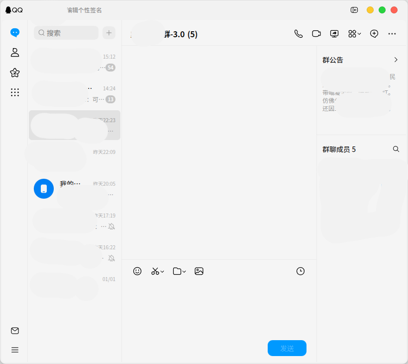

# WhiteSur titlebuttons

LiteLoaderQQNT 插件，让 QQ 窗口的按钮适配 WhiteSur 风格。

## 使用方法

clone 或下载 Releases 中的 zip 文件解压，将文件夹移动至 `plugins` 文件夹下面，重启 QQNT 即可

## 特别鸣谢
基于 [QQNT-LARGER-Close-Button](https://github.com/JoeYe-233/QQNT-LARGER-Close-Button/tree/main) 修改而来, 感谢原作者！
